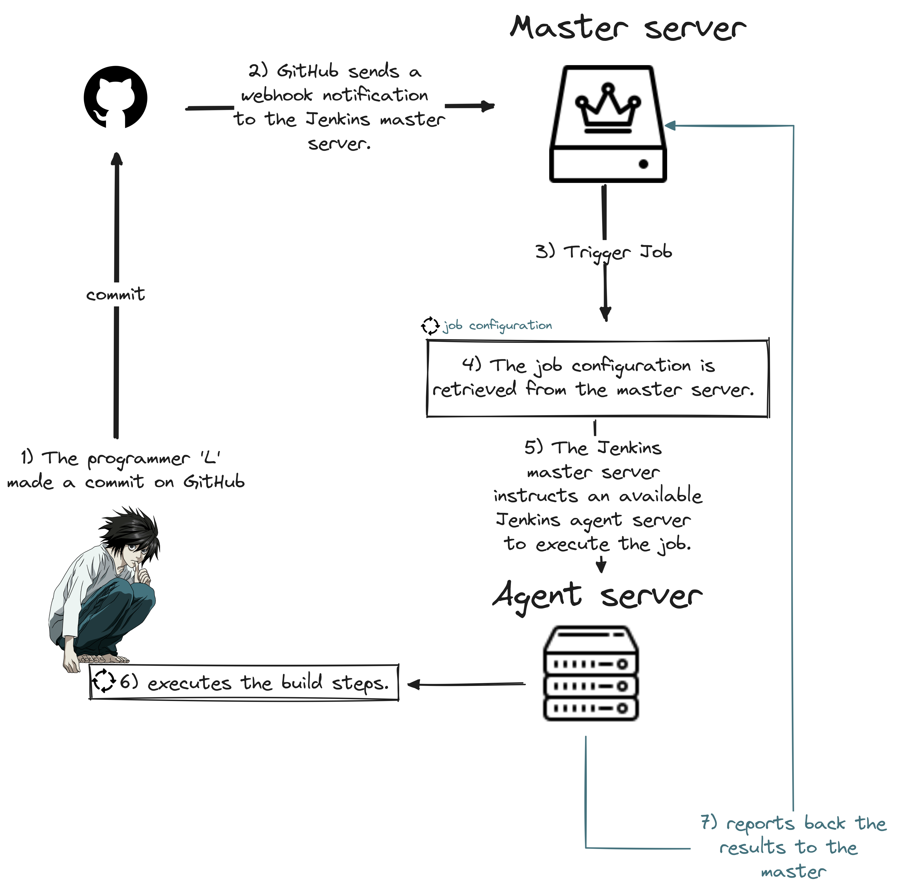

# Play.With.Jenkins

  
   
   <samp>
    Note that this repository provides insights to understand what Jenkins is, but it is not intended to be the main resource for anyone.
  </samp>  

### Table of content

1. [Jenkins infrastructure.](#desc0)
 

### Jenkins infrastructure.

- Master server
   - Controls pipelines.
   - Schedules builds
- Agents
   - perform the build
-  Take a look at this scenario:

   
- The two primary categories of Jenkins agents are:
  - Static Agent
    - Dedicated machine that is permanently configured to serve as a build agent.
    - It is always online and ready to accept build tasks from the Jenkins master.
  - Dynamic Agent
    - Machine that is provisioned on-demand to serve as a build agent.
    - Jenkins can dynamically spin up instances (virtual machines or containers) as needed and tear them down once the build is complete.
- In Jenkins, builds can generally be categorized into two primary types:
   - Freestyle Builds.
   - Pipeline Builds.

 
| **Freestyle Builds** | **Pipeline Builds** |
|:---|:---|
| **Overview:** 🐧 Traditional and simpler form of builds in Jenkins. 🐧 Configured through the Jenkins web interface using a graphical user interface (GUI). | **Overview:** 🐧 Defining the entire build and deployment process as code in a Jenkinsfile. 🐧 This approach enables a more flexible, maintainable, and version-controlled method for defining and executing builds. |
| **Configuration:** 🐧 Users can define build steps, post-build actions, and configurations through the Jenkins UI without the need for scripting. 🐧 It is a point-and-click approach to configuring and running builds. | **Configuration:** 🐧 Pipelines are configured using a domain-specific language (DSL) based on Groovy. 🐧 The pipeline script is typically stored alongside the application code in version control (e.g., Git). |
| **Use Cases:** 🐧 often used for projects with uncomplicated build and deployment processes. | **Use Cases:** 🐧 often used for projects with complex build requirements, multiple environments, and the need for version-controlled and shareable build configurations. |
