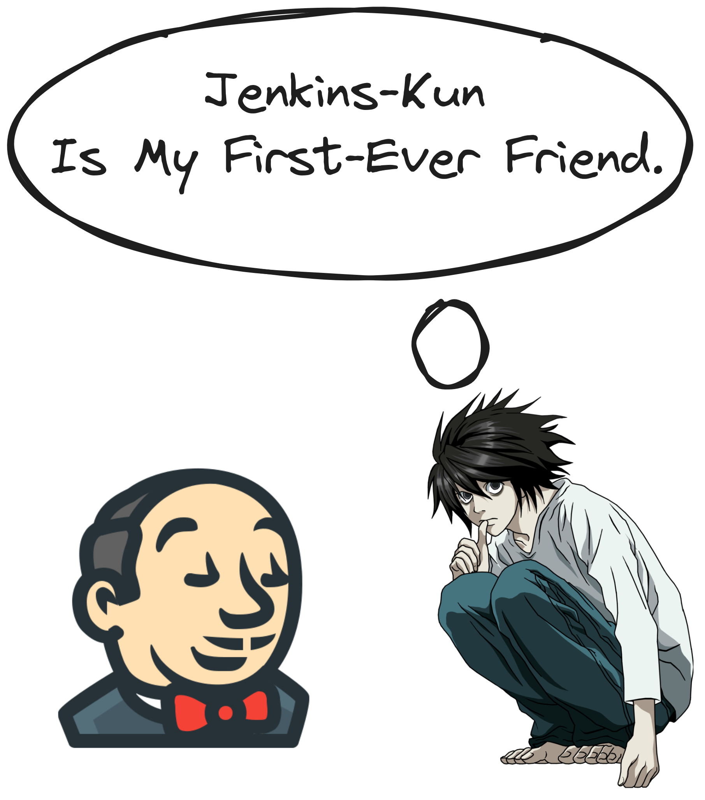

# Play.With.Jenkins

  
   
   <samp>
    Note that this repository provides insights to understand what Jenkins is, but it is not intended to be the main resource for anyone.
  </samp>  

### Table of content

1. [Jenkins infrastructure.](#desc0)
 

### Jenkins infrastructure.
